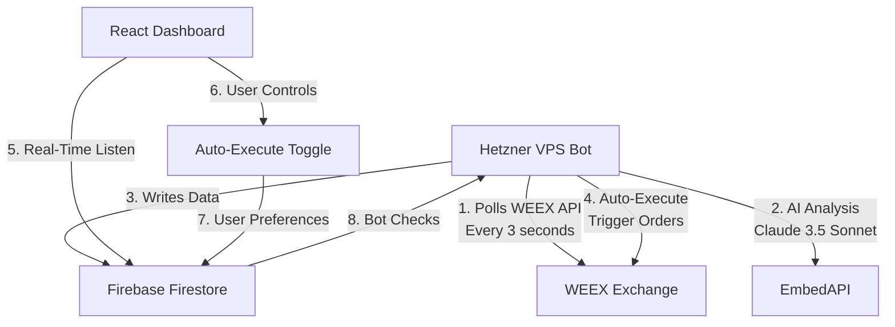

# Aetheris: Hybrid AI Trading & Sentiment Engine

**Version:** 1.1.0 (Hackathon Edition)  
**Architecture:** Hybrid (Backend AI Agent + VPS Execution Node + Real-Time Frontend)  
**Submission Date:** 2025/12/31  
**Category:** DeFi / AI / Fintech / Automated Trading  

## 🚀 Executive Summary

**Aetheris** is a production-ready, AI-powered cryptocurrency arbitrage trading platform that combines real-time market scanning, intelligent opportunity validation, and automated trade execution. Built for the WEEX AI Wars competition, Aetheris demonstrates how modern AI can be seamlessly integrated into trading infrastructure to create a fully autonomous, sentiment-aware arbitrage system.

### Key Innovation: Backend AI Agent with WEEX Integration

Our **amazing backend AI bot agent** runs 24/7 on a Hetzner VPS, powered by **Claude 3.5 Sonnet via EmbedAPI**. Every arbitrage opportunity detected by our market scanner is automatically analyzed by this AI agent, which evaluates:

- **Market Conditions:** Spread percentage, price differentials, projected profit
- **Risk Assessment:** Volatility analysis, market depth, liquidity considerations  
- **Sentiment Analysis:** AI-powered sentiment scoring (-1 to +1) with confidence levels
- **Trading Recommendations:** APPROVE, REJECT, or CAUTION based on comprehensive analysis

The AI agent processes opportunities in real-time, updating alerts with detailed reasoning and sentiment scores. This enables **smart contract-like automated execution** when pre-defined conditions are met, reducing manual intervention and improving trading efficiency.

---

## 🏗️ System Architecture



### Why This Architecture?

* **Static IP Requirement:** WEEX requires a fixed IP for API access. Serverless functions rotate IPs. We use a lightweight Hetzner VPS to guarantee a static identity.
* **Backend AI Agent:** AI analysis runs securely on the VPS using EmbedAPI, keeping API keys safe and enabling 24/7 autonomous operation.
* **Real-Time Sync:** Firestore acts as the bridge. The VPS writes data, and the React frontend updates automatically without manual refreshing.
* **Automated Execution:** WEEX Trigger Orders enable smart contract-like behavior—trades execute automatically when conditions are met.

---

## ✨ Current Feature Set

### 🤖 AI-Powered Features

1. **Backend AI Agent (VPS Bot)**
   - **Claude 3.5 Sonnet** via EmbedAPI for opportunity analysis
   - Processes every arbitrage opportunity automatically
   - Returns sentiment scores, confidence levels, and detailed reasoning
   - Updates alerts with AI validation in real-time
   - **WEEX AI Log Upload:** Compliant with WEEX AI Wars requirements

2. **Intelligent Opportunity Validation**
   - AI analyzes spread, profit, risk level, and market conditions
   - Sentiment scoring (-1 to +1) with confidence (0 to 1)
   - Automatic approval/rejection based on AI recommendations
   - Detailed reasoning provided for each decision

### ⚡ Automated Trading Features

3. **Smart Contract-Like Auto-Execution**
   - **Immediate AI-Approved Execution:** When AI approves a trade (sentiment > 0.3, confidence > 0.6), the bot automatically places a market order for ~10 USDT immediately
   - **WEEX Trigger Orders:** Trades execute automatically when price conditions are met
   - User-controlled auto-execute toggle with risk level selection
   - Respects user preferences (LOW/MEDIUM/HIGH risk tolerance)
   - Falls back to market orders if trigger orders fail
   - Reduces manual intervention and improves trading efficiency
   - **Zero-Delay Execution:** Approved trades are executed instantly, no waiting for manual confirmation

4. **Real-Time Market Data**
   - Live price feeds (updated every 3 seconds)
   - Order book depth visualization
   - Recent trades feed
   - Open interest tracking
   - Funding rates monitoring
   - Account balance display

### 📊 Professional Trading Dashboard

5. **Comprehensive Trading Interface**
   - **Dashboard:** Real-time arbitrage opportunities with AI validation
   - **Balance Page:** Account balance, open positions, trade history
   - **Orders Page:** Order book, recent trades, open interest, funding rates
   - **Positions Page:** Active positions and trading history
   - **Profile Page:** User settings, trading statistics, account management

6. **Advanced UI/UX**
   - Glassmorphism design with smooth animations
   - Real-time sentiment gauge (react-gauge-chart)
   - Notification system for all user actions
   - Responsive grid layouts
   - Professional navigation with trading sub-menus

### 🔐 Security & Risk Management

7. **AI-Enhanced Security**
   - Pre-trade validation prevents execution if volatility or negative sentiment exceeds thresholds
   - Risk level assessment (LOW/MEDIUM/HIGH)
   - User-controlled risk tolerance settings
   - Comprehensive audit logging

8. **User Authentication**
   - Firebase Authentication (Email/Password + Google OAuth)
   - Secure user-specific data access
   - Profile management

---

## 🛠️ Technical Implementation

### A. The Engine (VPS / Backend AI Agent)

A persistent Node.js process managed by `PM2`, running 24/7 on Hetzner VPS.

**Core Responsibilities:**
- **Market Scanning:** Polls WEEX API every 3 seconds for BTC, ETH, BNB prices
- **Arbitrage Detection:** Calculates spreads and identifies profitable opportunities
- **AI Analysis:** Uses Claude 3.5 Sonnet (via EmbedAPI) to validate every opportunity
- **Auto-Execution:** Monitors user preferences and executes trades using WEEX Trigger Orders
- **Data Ingestion:** Polls order books, recent trades, open interest, funding rates, account balance

**AI Integration:**
```javascript
// Every PENDING alert is analyzed by the AI agent
const analysis = await backendAIService.analyzeOpportunity(alert, [
  `Market spread: ${alert.spread?.toFixed(2)}%`,
  `Risk level: ${alert.risk_level}`,
  `Projected profit: $${alert.projected_profit?.toFixed(2)}`
]);

// AI returns: sentiment_score, confidence, reasoning, recommendation
// Alert is APPROVED if: sentiment > 0.3 AND confidence > 0.6

// If approved AND auto-execute is enabled, immediately place market order
if (approval && autoExecuteEnabled) {
  const orderSize = 10 / currentPrice; // ~10 USDT
  await placeMarketOrder({ symbol, side, size: orderSize });
  // Trade executes instantly - no manual intervention needed!
}
```

**WEEX API Integration:**
- ✅ Market Data: Tickers, Order Books, Recent Trades, Candles
- ✅ Account Management: Balance, Positions, Settings
- ✅ Trade Execution: Market Orders, Trigger Orders, TP/SL Orders
- ✅ AI Log Upload: Compliant with WEEX AI Wars requirements

### B. The Client (React / Frontend)

**Role:** Real-time visualization, user controls, and decision support.

**Key Features:**
- Real-time Firestore listeners (`onSnapshot`) for instant updates
- Auto-execute toggle with risk level controls
- Comprehensive notification system
- Professional trading interface
- Responsive design with glassmorphism UI

**Real-Time Data Hooks:**
- `useAlerts()` - Arbitrage opportunities
- `useLiveFeed()` - Market prices
- `useAccountBalance()` - Account balance
- `useOrderBook()` - Market depth
- `useRecentTrades()` - Trade feed
- `useOpenInterest()` - Market participation
- `useFundingRate()` - Funding rates

---

## 📊 Data Schema (Firestore)

### Collection: `alerts` (Written by VPS, Updated by AI Agent)
Arbitrage opportunities with AI validation.
```json
{
  "type": "ARBITRAGE",
  "symbol": "cmt_btcusdt",
  "asset": "BTC_USDT",
  "spread": 1.2,
  "weex_price": 42050.00,
  "other_price": 42100.00,
  "projected_profit": 12.50,
  "risk_level": "MEDIUM",
  "status": "APPROVED",
  "auto_execute": true,
  "ai_validation": {
    "sentiment_score": 0.65,
    "confidence": 0.82,
    "reasoning": "Strong arbitrage opportunity with moderate risk...",
    "recommendation": "APPROVE"
  },
  "created_at": "2025-12-31T12:00:00Z",
  "analyzed_at": "2025-12-31T12:00:05Z"
}
```

### Collection: `user_preferences` (User Settings)
Auto-execute preferences per user.
```json
{
  "auto_execute_enabled": true,
  "auto_execute_max_risk": "MEDIUM",
  "updated_at": "2025-12-31T12:00:00Z"
}
```

### Collection: `live_feed` (Real-Time Market Data)
```json
{
  "docId": "BTC_USDT",
  "price": 42050.00,
  "exchange": "WEEX",
  "spread_pct": 1.2,
  "last_updated": "2025-12-31T12:00:00Z"
}
```

---

## 🚀 Deployment Guide

### Phase 1: Database & Auth (Firebase)

1. Create Firebase Project: `hackathon-project-245ba`
2. Enable **Firestore Database**
3. **Generate Private Key:**
   - Go to Project Settings → Service Accounts
   - Click "Generate New Private Key"
   - Save as `engine/service-account.json` (DO NOT COMMIT)

### Phase 2: The Bot (Hetzner VPS)

1. SSH into VPS
2. Clone repo and navigate to `/engine`
3. Upload `service-account.json` to this folder
4. Create `.env` file:
   ```env
   WEEX_API_KEY=your_api_key
   WEEX_SECRET_KEY=your_secret_key
   WEEX_PASSPHRASE=your_passphrase
   WEEX_ACCOUNT_ID=your_account_id
   EMBEDAPI_KEY=your_embedapi_key
   FIREBASE_PROJECT_ID=hackathon-project-245ba
   ```
5. Install & Run:
   ```bash
   npm install
   npm install -g pm2
   pm2 start bot.js --name "aetheris-engine"
   pm2 save
   pm2 startup
   ```

### Phase 3: The Dashboard (Firebase Hosting)

1. Navigate to `/client`
2. Build:
   ```bash
   npm run build
   ```
3. Deploy:
   ```bash
   firebase deploy --only hosting,firestore:rules
   ```

---

## 🎯 Feature Breakdown

### ✅ Implemented Features

1. **Arbitrage Opportunity Detector**
   - VPS bot polls WEEX API every 3 seconds
   - Detects spreads > 1% automatically
   - Creates alerts with risk assessment

2. **Backend AI Agent (Claude 3.5 Sonnet)**
   - Analyzes every opportunity automatically
   - Returns sentiment scores, confidence, and reasoning
   - Approves/rejects based on AI analysis
   - **WEEX AI Log Upload:** Compliant with competition requirements

3. **Smart Contract-Like Auto-Execution**
   - **Immediate Execution:** When AI approves a trade, market orders are placed automatically (~10 USDT per trade)
   - WEEX Trigger Orders for automated execution
   - User-controlled toggle with risk level selection
   - Executes trades instantly when AI is satisfied
   - Reduces manual intervention to zero for approved trades

4. **Real-Time Market Sentiment Dashboard**
   - Live sentiment gauge visualization
   - Real-time market data updates
   - Professional trading interface

5. **Comprehensive Trading Pages**
   - Balance, Orders, Positions pages
   - Order book, recent trades, open interest
   - Account balance display in nav

6. **AI-Enhanced Security / Risk Management**
   - Pre-trade validation with AI
   - Risk level assessment
   - User-controlled risk tolerance

7. **Professional UI/UX**
   - Glassmorphism design
   - Notification system
   - Responsive layouts
   - Smooth animations

---

## 🔮 Future Development Opportunities

While we've built a comprehensive, production-ready trading platform, there are exciting opportunities for future enhancements:

### 🚧 Not Implemented (Due to Time Constraints)

**Multi-Social Media AI Sentiment Analysis:**
- Real-time sentiment aggregation from Twitter/X, Reddit, Telegram, Discord
- Cross-platform sentiment correlation
- Social signal integration into trading decisions
- Community sentiment trends and influencer tracking

This would require:
- Social media API integrations (Twitter API, Reddit API, etc.)
- Advanced NLP models for sentiment extraction
- Real-time data streaming infrastructure
- Sentiment aggregation and correlation algorithms

**This opens the door for exciting development opportunities** to enhance the platform with social sentiment intelligence, making Aetheris even more powerful by incorporating the "wisdom of the crowd" into trading decisions.

### 💡 Additional Future Features

- **Multi-Exchange Arbitrage:** Expand beyond WEEX to multiple exchanges
- **Portfolio Rebalancing:** Automated position management
- **Advanced Order Types:** Iceberg orders, TWAP, VWAP
- **Backtesting Engine:** Historical strategy validation
- **Mobile App:** Native iOS/Android applications
- **Trading Bots Marketplace:** Community-contributed strategies

---

## 🏆 Why Aetheris Stands Out

1. **Production-Ready Architecture:** Not a prototype—fully functional trading system
2. **Backend AI Agent:** Autonomous AI that analyzes and validates every opportunity
3. **WEEX Integration:** Full API integration including trigger orders and AI log upload
4. **Smart Automation:** Trigger orders enable true automated execution
5. **Professional UI:** Enterprise-grade trading interface
6. **Real-Time Everything:** Zero-delay data synchronization
7. **User Control:** Granular risk management and auto-execute preferences

---

## 🛠️ Technology Stack

- **Frontend:** React + Vite + React Router
- **UI Components:** react-gauge-chart, custom glassmorphism design
- **Backend:** Node.js (VPS) + Firebase Admin SDK
- **AI:** Claude 3.5 Sonnet via EmbedAPI
- **Database:** Firebase Firestore (real-time)
- **Authentication:** Firebase Auth (Email/Password + Google OAuth)
- **Deployment:** Hetzner VPS (bot) + Firebase Hosting (frontend)
- **API:** WEEX Trading API (Full integration)
- **Process Management:** PM2

---

## 📈 Quick Start

```bash
# 1. Install dependencies
cd client && npm install
cd ../engine && npm install

# 2. Configure Firebase
# Add service-account.json to engine/ directory
# Add .env file with WEEX and EmbedAPI credentials

# 3. Start VPS bot
cd engine
pm2 start bot.js --name "aetheris-engine"

# 4. Start frontend (development)
cd ../client
npm run dev

# 5. Deploy frontend (production)
npm run build
firebase deploy --only hosting
```

---

## 📝 License

MIT

---

## 🙏 Acknowledgments

Built for the **WEEX AI Wars Competition**. Special thanks to:
- WEEX Exchange for the comprehensive trading API
- EmbedAPI for seamless AI integration
- Firebase for real-time infrastructure
- Hetzner for reliable VPS hosting

---

**Aetheris** - *Where AI Meets Automated Trading* 🤖⚡💰
